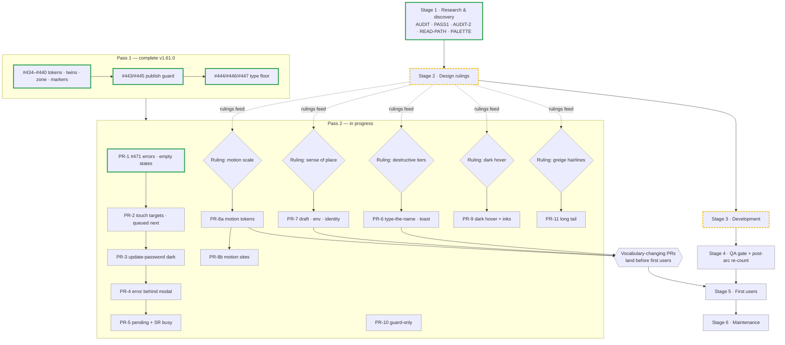

# PLAN.md — the staged plan for the rest of the design-system adoption

**Written 2026-08-26**, app at **v1.64.0** (live `/api/build-id` = `d7ac640`, verified same day). Companion to `AUDIT.md` / `PASS1-TOKENS.md` / `AUDIT-2.md` / `READ-PATH-ASSESSMENT.md` / `PALETTE-ASSESSMENT.md` and `SEAT-PLANNER-HANDOFF.md`. AUDIT-2 ranks findings but sequences nothing — **this document is the sequence.** It goes to the design reviewer for ruling before any stage inside it starts; PR-2 gets its own brief once the plan is ruled.

Position-statement verification (per the brief): checked against the repo and the live deployment — **accurate as written, no corrections**. Pass 1 complete and prod-verified #434–#447 (handoff §2), seven guards (handoff §4), F1–F8 closed 2026-08-25 (`READ-PATH-ASSESSMENT.md` ranked table); AUDIT-2 §0 items 1 and 3 closed by #471 v1.64.0, item 6 partial (single-flight closed, pending + SR busy open), items 2/4/5/7/8/9/10 open with no guard (AUDIT-2 §0/§9); readiness 5 of 6 boxes, the open one a product decision (handoff §10).

---

## The status board

Update the `classDef` assignments **in the same commit as every PR that lands** — a stale board is worse than none. One deliberate deviation from the brief's starting diagram: **PR-2 is `todo`, not `wip`** — it is queued next (handoff §5) but has no branch and no PR, and this board records fact, not intent.

| PR | Stage | Findings | Status | Tag |
|---|---|---|---|---|
| Pass 1 (#434–#447) | 1–3 | tokens · twins · zone · markers · type floor · focus · publish guard | **done** | v1.61.0 |
| PR-1 (#471) | 3 | AUDIT-2 §0 items 1, 3, part of 6 | **done** | v1.64.0 |
| R1 ruling — destructive tiers | 2 | F-INT-1/2 | not started | — |
| R2 ruling — sense of place | 2 | F-SH-1/2/3 | not started | — |
| R3 ruling — motion scale | 2 | F-MO-4/5 | not started | — |
| R4 ruling — dark hover direction | 2 | F-DK-3 | not started | — |
| R5 ruling — greige hairlines | 2 | handoff §9 parked | not started | — |
| PR-2 touch targets | 3 | F-SP-4 (+ 28px family of F-SP-3) | not started — **queued next** | — |
| PR-3 update-password dark | 3 | F-DK-1 | not started | — |
| PR-4 error-behind-modal | 3 | F-INT-4 / F-FRM-1 | not started | — |
| PR-5 pending + SR busy | 3 | §8.1 remainder of §0 item 6 | not started | — |
| PR-6 destructive tiers + toast | 3 | F-INT-1/2 | not started · blocked on R1 | — |
| PR-7 sense of place | 3 | F-SH-1/2/3 | not started · blocked on R2 | — |
| PR-8a motion tokens | 3 | F-MO-4/5 | not started · blocked on R3 | — |
| PR-8b motion sites | 3 | F-MO-1/2/3 | not started · after PR-8a | — |
| PR-9 dark hover + inks | 3 | F-DK-3/4 | not started · blocked on R4 | — |
| PR-10 guard-only | 3 | §0 item 10, handoff §4 | not started | — |
| PR-11 long tail | 3 | F-SH-4/5/6 · F-KB-1/2/3 · F-FRM-2…8 · F-SP-1/2 · §9 doc errors | not started | — |

---

## Stage 1 — Research & discovery

- **Entry:** Pass-1 arc complete (v1.61.0).
- **Deliverables (all shipped):** `AUDIT.md` (Pass 1), `PASS1-TOKENS.md`, `AUDIT-2.md` (#470, corrected same day against the fixed Carbon scale), `READ-PATH-ASSESSMENT.md` (#450), `PALETTE-ASSESSMENT.md` (#457), `DOCS-DIFF.md` (skill-refresh baseline).
- **Exit:** every shipped surface audited across motion, spacing, patterns, shell, keyboard, dark parity, and absences; findings ranked (AUDIT-2 §0) and guard-mapped (§9).
- **Guard added:** none — reports, not code.
- **Status: done** — last artifact 2026-08-26 (#470).

One discovery item remains open, already scoped: the handoff §4 **circumstantial-allowlist weakness** (allowlist reasons that are claims about today's component tree go stale silently — the `--sp-surface-disabled` incident). The fix is categorization + mechanical verification and is homed in **PR-10**. Nothing new to research; this stage does not reopen.

## Stage 2 — UI/UX design (rulings)

- **Entry:** this plan ruled.
- **Deliverables:** five rulings, recorded in the handoff ledger the way Pass-1 rulings are (handoff §3/§8).
- **Exit:** each item below carries an owner/reviewer decision; its Stage-3 PR is then unblocked.
- **Guard added:** none at this stage — each ruling's guard ships with its PR.
- **Status: in progress** — Pass-1 rulings done; the five Pass-2 rulings below are open. They are independent and can be ruled in any order, in parallel with PR-2…PR-5.

These need ruling **before code** because they change visual vocabulary (free now, expensive after first users) or product behavior. Each is a recommendation with measured values, not an implementation.

**R1 — Destructive tiers + toast timer (F-INT-1/2).** 0 of the 4 High-tier destructive actions require typing the resource name (AUDIT-2 §3): publish, discard draft ("This cannot be undone"), snapshot restore, reset-to-published; CSV import is borderline. Recommendation: **type-the-name on the three draft/state-replacing one-click actions** — discard draft, snapshot restore, reset-to-published (each replaces the whole draft and clears Undo/Redo history after a single click) — and **leave publish as review-diff + single confirm**: publish already has the strongest review apparatus in the app, it is the core flow for non-technical staff, and its prior state concern is being addressed by the toast half of this ruling. Toast: the app's only toast auto-dismisses at 6 s while carrying Undo (`SeatMap.tsx:657-661`, `:3121-3133`) and is the **only** success confirmation for publish and discard — the two highest-consequence operations get the most ephemeral confirmation while CSV/restore/reset/deactivate get persistent banners. Recommendation: **persist-until-dismissed** (Carbon: a toast with an action must persist); the staleness concern recorded at `:651-656` is answered by explicit dismiss. The alternative (drop Undo from the toast — it stays in the toolbar — and keep the timer) preserves capability but keeps the confirmation disparity running the wrong way.

**R2 — Sense of place: draft marker, environment indicator, identity (F-SH-1/2/3).** Mode identity is persistent on 2 of 5 signed-in surfaces (clean `/admin` shows nothing; the "Draft · N changes" text is `hidden … lg:inline`, `SeatMap.tsx:2855`); an environment indicator exists on 0 of 7 surfaces in an app where local dev writes the production database; identity is behind a click on 6 of 7. Recommendation: **one ruling, one header vocabulary**, all three in the top bar. (a) A persistent mode tag ("Draft" on `/admin`/management/settings, "Published view" implied elsewhere) — always visible, not gated on `hasChanges` (contract #4's no-idle-chip ruling governs the *publish cluster*, not mode identity; the finding is compatible with it). (b) An environment tag rendered whenever the deployment cannot attest `VERCEL_ENV === "production"` — same attestation the publish guard already trusts (`lib/publishGuard.ts`), worded to the actual danger ("Local dev — writes production"), warning-family with text so it carries two signals. (c) Identity: email or name as persistent text beside the monogram at ≥lg, monogram-only below (`AccountMenu.tsx:158-160` currently menu-only). Where exactly in the 40px bar each sits is the ruling's call — the recommendation is only that all three share one placement decision so the header is designed once.

**R3 — Motion scale (F-MO-4/5).** Current scale `--sp-duration-fast/standard/deliberate` = 150/200/280 ms (`app/globals.css:139-141`) — only 150 is on Carbon's table; ~96 % of ~120 eased sites run an off-Carbon curve because `tailwind.config.ts` defines no `transitionTimingFunction`, so bare `transition-*` resolves to Tailwind's `cubic-bezier(0.4,0,0.2,1)`; Button/IconButton hover feedback runs 200 ms against Carbon's fast-01 **70 ms** budget. Recommendation (reviewer's stated default — endorse it): **adopt Carbon's six stops wholesale** — 70/110/150/240/400/700 as `--sp-duration-*` tokens — rather than a 3-stop subset: the app already needs at least five roles (hover feedback, fades/nav, small expansion, panels/toasts/modals, background dimming), so a subset would re-derive Carbon's table with gaps. Set Tailwind's default timing function to productive-standard `cubic-bezier(.2,0,.38,.9)` with named entrance/exit variants. Values-only in PR-8a; site migrations in PR-8b.

**R4 — Dark hover direction (F-DK-3).** In dark, 20 of 33 surface-hover sites reuse the light idiom `hover:bg-[var(--sp-background)]`, sinking controls below their resting surface (`#1f1f1f` → `#161616`); the dark-correct token already exists and 9 sites use it (`--sp-layer-hover: #262626`, one step *up*). Recommendation: rule **hover lightens in dark** (per Carbon), and make the mechanism a theme-aware role token — all surface-hover goes through `--sp-layer-hover` (or a sibling role), never through `--sp-background`. This is a one-line ruling that unblocks PR-9's mechanical sweep.

**R5 — The four greige hairlines (handoff §9, parked → un-parked here).** Four near-identical greige border values survive from the pre-token era (the last `border-[#D8D0C5]` literal lives in `UpdatePasswordForm.tsx`, F-DK-1's surface). Recommendation: **collapse to one border role token** in the `--sp-*` vocabulary; which of the four values wins (or whether an existing role token like the current subtle-border value absorbs them) is the ruling. Fix lands in PR-11 (and PR-3 removes the update-password instance in passing).

## Stage 3 — App development (the PR arc)

- **Entry per PR:** its ruling (where one is listed) is recorded; the preceding unblocked PR is merged or independent.
- **Deliverables:** PR-2 … PR-11 below.
- **Exit:** all AUDIT-2 §0 items closed or explicitly re-parked; every territory in the §9 guard map has a pin.
- **Status: in progress** — PR-1 shipped (#471, v1.64.0); PR-2 queued next.

The reviewer's proposed order, validated against the repo — **it stands, no reorder**. The only observation worth recording: R1–R5 are independent of PR-2…PR-5, so rulings should run in parallel with the early PRs — PR-6/7/8a must not end up serialized behind PR-5 when their only real dependency is a ruling.

| PR | Scope | Findings | Guard shipped with it |
|---|---|---|---|
| PR-1 | **done #471 v1.64.0** — prod-safe error paths, single-flight, first-run states | §0 items 1, 3, part of 6 | `action-error-contract-source`, `client-action-error`, ct/source guards on all five empty states |
| PR-2 | Touch-target / hit-expansion sweep | F-SP-4 (absorbs the 28px family of F-SP-3) | source scan: every interactive spec <44px has an `after:-inset-*` reaching 44; or enable axe `target-size` (WCAG 2.2 tag) |
| PR-3 | `/auth/update-password` dark theme | F-DK-1 | dark-completeness reverse-direction check |
| PR-4 | Error-behind-modal | F-INT-4 / F-FRM-1 | ct test: server error visible inside the open dialog |
| PR-5 | Pending indication + SR busy on all 17 mutating flows | §8.1 remainder of §0 item 6 | source test: every mutating flow has a live region + pending UI |
| PR-6 | Destructive tiers + toast timer | F-INT-1/2 (after R1) | source test: High-tier confirm requires typed name; no `role="alert"` on a timer with an action |
| PR-7 | Sense of place — draft marker, env indicator, identity | F-SH-1/2/3 (after R2) | source test: marker present on every admin surface; env indicator when not `VERCEL_ENV=production` |
| PR-8a | Motion tokens — **values only**: duration scale, timing-function defaults | F-MO-4/5 (after R3) | test pins `--sp-duration-*` to Carbon table; pins Tailwind timing default |
| PR-8b | Motion sites — reduced-motion on transitions, kill `sp-chip-pop` bounce, one-axis entrances | F-MO-1/2/3 | regex: no keyframe travels past 100%; no transition without `motion-reduce:` |
| PR-9 | Dark hover direction + hardcoded JSX inks/glints | F-DK-3/4 (after R4) | scan: no `text-white`/`#fff` literals in JSX over theme-flipped fills |
| PR-10 | Guard-only: 8px grid + control ladder scan; circumstantial-allowlist categories | §0 item 10, handoff §4 | the guards *are* the PR |
| PR-11 | Long tail: F-SH-4/5/6, F-KB-1/2/3, F-FRM-2…8, F-SP-1/2 drift, §9 parked doc errors, greige hairlines (after R5) | — | per item |

**Rules that hold across every PR:**

- One PR = one concern.
- Mechanical changes (renames, no-value-moves) and design changes (value moves) go in **separate PRs** — the rename PR's only cheap check is that no computed value moved (handoff §8).
- Every fix ships its guard **in the same PR**.
- Anything that changes *which elements get which classes* needs a **live visual pass in both themes** regardless of suite colour — `resolved-map`/`dangling-refs` read CSS and cannot see the DOM (handoff §8).

## Stage 4 — Testing & QA

- **Entry:** runs per-PR from PR-2 onward; the post-arc re-count runs once PR-11 merges.
- **Deliverables:** the per-PR gate below; one post-arc re-count appended to `AUDIT-2.md` (or a companion note).
- **Exit:** every AUDIT-2 inventory proportion re-measured and at its target.
- **Guard added:** the gate itself is process; the re-count verifies the guards shipped in Stage 3.
- **Status: not started** (gate applies from the next PR).

**Per-PR gate — all five, every PR:**

1. `npm test` green, **including the PR's new guard**.
2. The seven Pass-1 guards untouched (`dangling-refs`, `resolved-map`, `zone-completeness`, paired-marker scan, `marker-contrast`, `desktop-seat-marker-system-source`, `type-floor-source` — handoff §4).
3. Axe tiers pass.
4. Live visual pass, light **and** dark (build/typecheck/tests are not visual verification).
5. `/api/build-id` matches the merged SHA after deploy.

**Post-arc QA — re-run the AUDIT-2 inventories and record the new proportions against the original frame.** "20 of 33 hover sites" becomes "0 of 33" or it isn't done:

| Inventory (AUDIT-2 frame) | Was | Target |
|---|---|---|
| Transition sites without `motion-reduce:` | ~100 of ~106 | 0 (or a ruled exemption list) |
| Eased sites off-curve | ~96 % of ~120 | 0 |
| Interactive specs <44px without hit-expansion | ~17 of ~21 | 0 |
| Dark surface-hover sites sinking | 20 of 33 | 0 |
| Mutating flows without pending UI / SR busy | 4 / 12 of 17 | 0 / 0 |
| High-tier actions without their ruled confirmation strength | 4 of 4 | 0 |
| Spacing buckets (172 occurrences, 51 % exempt) | 34 % near-miss / 8 % off-system | re-measured, recorded |

## Stage 5 — Deployment & launch

- **Entry:** handoff §10's last box — **a decision about who goes first and what to learn from them.** A product decision, not design work; nothing in this plan produces it.
- **Deliverables:** none new — deployment is **continuous**: merge to `main` auto-applies migrations and deploys via Vercel (there is no release process to invent). "Launch" means **first users**.
- **Exit:** first users in the app.
- **Guard added:** none.
- **Status: not started.**

**Vocabulary-changing PRs that should land before first users** (visual vocabulary is free now, expensive after): **PR-6** (confirmation strength), **PR-7** (header vocabulary), **PR-8a** (motion feel). Everything else — including PR-8b's site sweep, PR-9, PR-10, PR-11 — can follow with users present.

## Stage 6 — Maintenance & support

- **Entry:** continuous from now; formally the steady state after Stage 5.
- **Deliverables / practices:**
  - **Skill refresh cadence** — handoff §11 method: diff `feature-flags.yml` between `@carbon/react` tags, read release bodies for intervening minors only; `DOCS-DIFF.md` is the baseline. Footer dates on the docs sites are build stamps, never evidence (two confirmed false alarms).
  - **v12 stance** — keep the semantic token layer clean (`--sp-*` role names over Carbon tokens over raw values): the `@carbon/upgrade` codemod operates on that layer; a clean layer *is* the migration preparation.
  - **§9 parked list, with an owner each:** circumstantial-allowlist verification → **PR-10** (leaves the parked list); greige hairlines → **R5 + PR-11** (leaves the parked list); arbitrary spacing values (172-occurrence frame, corrected from "442") → stays parked, maintenance-only, re-counted in Stage 4's post-arc QA; `--admin-diff-vacated-text` / `--admin-paper` / §3.7 reception-row doc errors → **PR-11**.
  - **Handoff update reflex** — update `SEAT-PLANNER-HANDOFF.md` on every tag, same reflex as `/api/build-id` verification; this plan's status board updates in the same commit as every PR that lands.
- **Exit:** none — this stage is the steady state.
- **Status: practices already in force; formal stage begins after Stage 5.**
